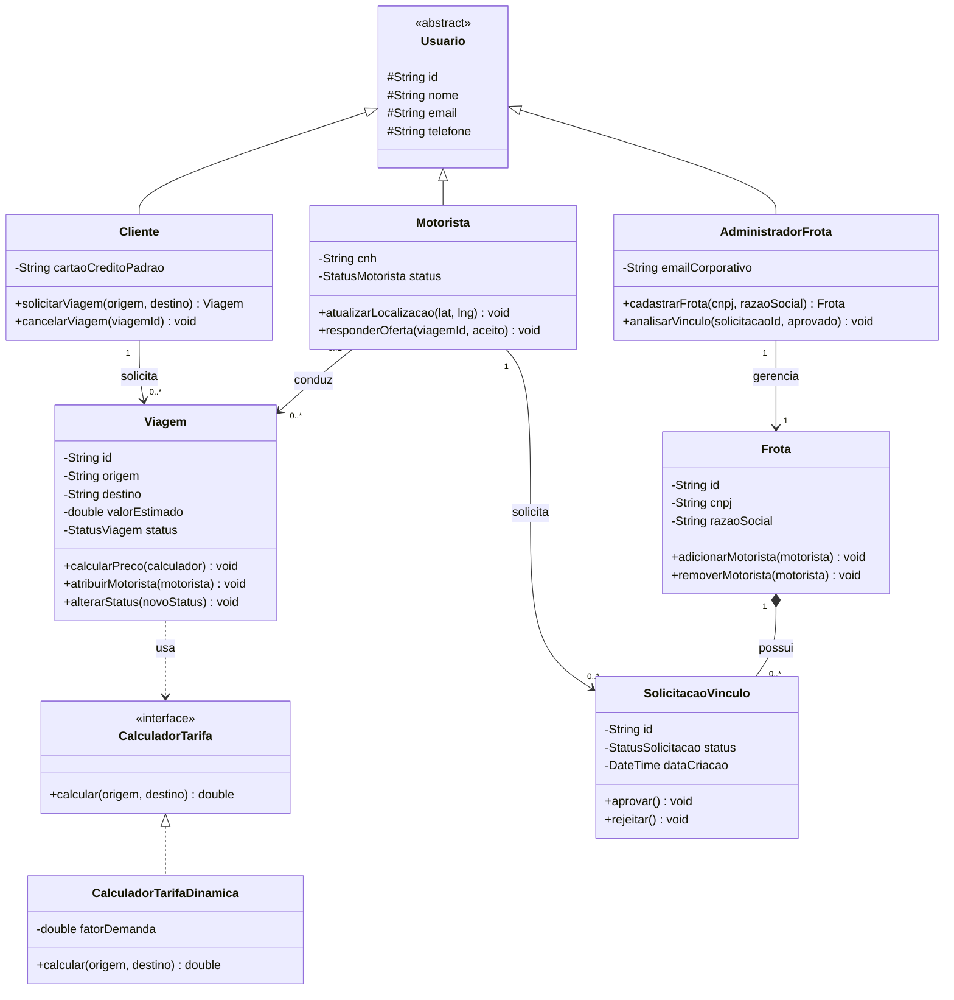

# 1. Diagrama de Classes

Este módulo apresenta o modelo estrutural de classes que dão suporte às três fatias verticais selecionadas no escopo. O design foi projetado focado nos princípios de alta coesão e baixo acoplamento, evitando o surgimento de classes controladoras infladas (*God Classes*).

## Diagrama em Mermaid

Detalhamento das Classes e Responsabilidades
1. Entidades de Atores (Herança de Usuario)

    Usuario (Abstrata): Concentra os atributos de identificação comuns (id, nome, email, telefone). Suas propriedades utilizam visibilidade protegida (#) para herança segura.

    Cliente: Herda de Usuario. Contém dados de faturamento e encapsula o comportamento de iniciar o fluxo de viagem e cancelamentos.

    Motorista: Herda de Usuario. Armazena o documento profissional (cnh) e o estado atual de disponibilidade (status). É responsável por responder às ofertas disparadas pelo motor de matching.

    AdministradorFrota: Herda de Usuario. Responsável pela gestão corporativa, detendo privilégios para registrar a pessoa jurídica e chancelar novos motoristas parceiros.
    
2. Entidades do Core de Negócio

    Viagem: Concentra a inteligência de um deslocamento. Ela gerencia o ciclo de vida da corrida (StatusViagem) e expõe métodos para receber o motorista associado. Depende de uma abstração de cálculo para definir seu preço.

    Frota: Representa a entidade corporativa gerenciada por um Administrador. Ela possui uma relação de Composição (*--) com as solicitações de vínculo, significando que o histórico de solicitações pertence estritamente ao ciclo de vida daquela frota.

    SolicitacaoVinculo: Classe associativa que gerencia a intenção de um Motorista se unir a uma Frota. Possui estados intermediários (Pendente, Aprovado, Rejeitado).

3. Abstrações e Polimorfismo

    CalculadorTarifa (Interface) & CalculadorTarifaDinamica: Implementação do padrão de projeto Strategy. Em vez de embutir regras complexas de precificação (distância, tempo, tráfego e multiplicador dinâmico) dentro da classe Viagem, delegamos essa responsabilidade para uma interface, permitindo que novas regras de cálculo sejam plugadas futuramente sem alterar o core do sistema.
