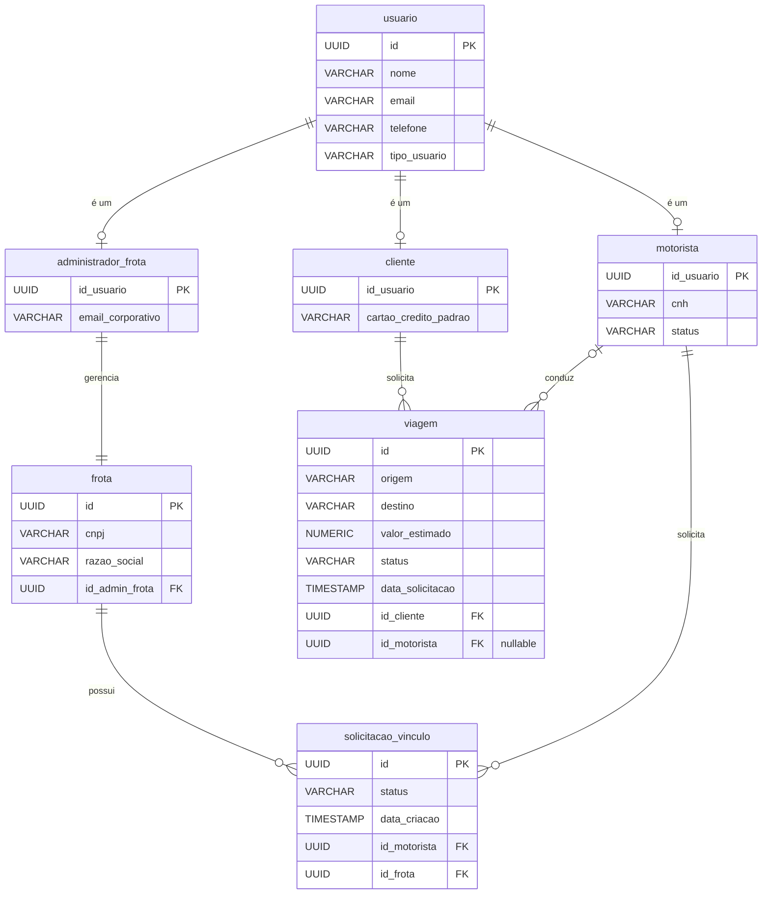

# 2. Modelo Entidade-Relacionamento (MER)

Este módulo apresenta a modelagem de dados para as classes persistentes identificadas nas fatias selecionadas. O modelo foi desenhado para garantir integridade referencial, evitar anomalias de atualização e preparar a base para sistemas distribuídos.

## Diagrama MER

Dicionário de Dados e Tipagem

Para a modelagem, os tipos de dados foram arquitetados visando bancos relacionais robustos, utilizando estruturas adequadas para garantir precisão, escalabilidade e otimização de consultas e controle de locks transacionais:
* Chaves Primárias (PK): Utilizou-se UUID para todas as chaves primárias e estrangeiras. Isso previne colisões em ambientes distribuídos, facilita a criação de registros descentralizados (offline first) e evita vazamento de volume de dados (como ocorreria com IDs sequenciais).
* Valores Monetários: NUMERIC(10,2) na tabela viagem para valor_estimado, garantindo a precisão exata de casas decimais em cálculos financeiros, evitando os erros de arredondamento comuns do tipo float.
* Strings e Textos: Utilização de limites lógicos na implementação física, como VARCHAR(18) para CNPJ, VARCHAR(20) para CNH e telefone, e VARCHAR(255) para origens e destinos.
* Datas e Tempos: TIMESTAMP para rastreamento cronológico exato em viagem e solicitacao_vinculo.

Coerência com o Diagrama de Classes e Justificativas
Conforme esperado ao traduzir um modelo orientado a objetos para o paradigma relacional, algumas decisões arquiteturais foram tomadas para resolver os mapeamentos:
* Estratégia de Herança (Table-per-Subclass): No diagrama de classes, Cliente, Motorista e AdministradorFrota herdam da classe abstrata Usuario. No MER, optou-se pela estratégia de Tabela por Subclasse. A tabela principal usuario guarda os dados comuns e um discriminador (tipo_usuario).
* As tabelas filhas (cliente, motorista, administrador_frota) possuem chaves primárias que também atuam como chaves estrangeiras apontando para usuario.id. Justificativa: Evita uma "tabela gigante" (Single Table) cheia de colunas nulas e mantém a integridade referencial forte, permitindo restrições granulares.
* Chave Estrangeira Opcional na Viagem: A classe Viagem tem uma relação 0..1 com Motorista (uma viagem recém-criada pode ainda não ter um motorista atribuído). No MER, isso foi traduzido como a coluna id_motorista permitindo valores nulos (nullable) na tabela viagem.
* Abstrações Comportamentais Omitidas: A interface CalculadorTarifa e sua implementação CalculadorTarifaDinamica presentes no diagrama de classes não geraram tabelas no MER. Justificativa: Elas encapsulam lógica e algoritmos de cálculo em tempo de execução, não possuindo estado estrutural que precise ser persistido no banco de dados para essas fatias específicas.
