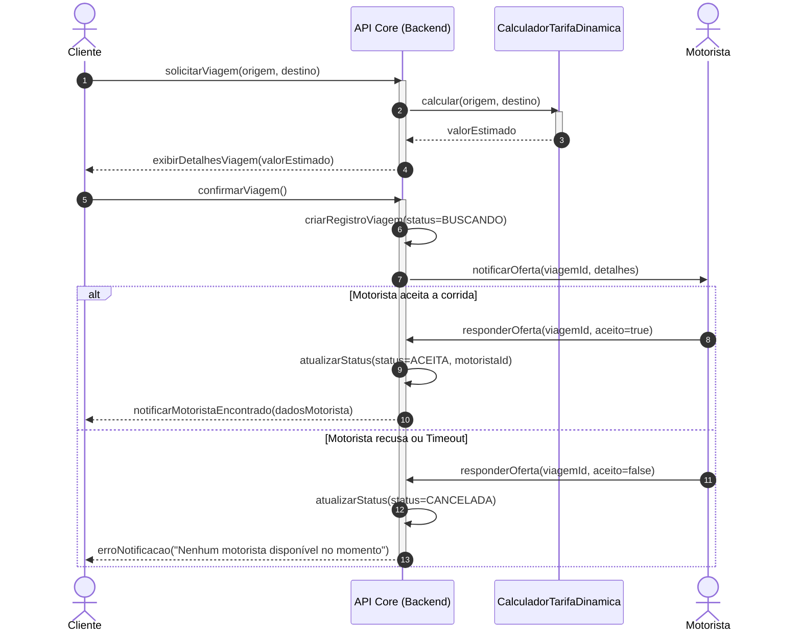

# 3.1 Modelagem Comportamental - Fatia 1

**Fatia:** Cliente solicita uma viagem no aplicativo

**Justificativa da escolha do diagrama:** Escolhemos o **Diagrama de Sequência** porque esta fatia envolve alta coordenação síncrona e assíncrona entre o ator (Cliente), o backend (Core de Viagens), os serviços de cálculo e o segundo ator (Motorista). A sequência temporal e os fluxos alternativos (aceite vs. recusa) são críticos para entender esse Must Have.

## Diagrama de Sequência: Solicitação de Viagem

