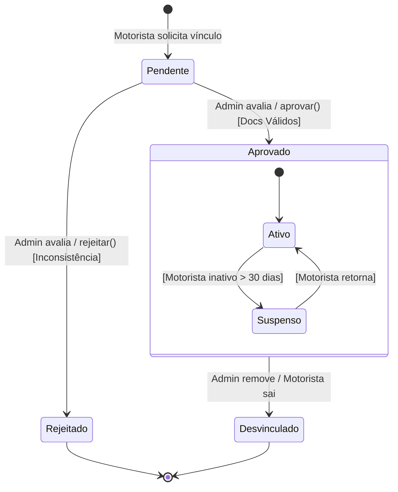

# 3.2 Modelagem Comportamental - Fatia 2

**Fatia:** Motorista se cadastra em uma frota

**Justificativa da escolha do diagrama:** Escolhemos o **Diagrama de Estados** porque a essência dessa fatia não é a troca de mensagens imediatas, mas sim o ciclo de vida da entidade `SolicitacaoVinculo`. Há transições críticas acionadas por eventos (aprovação ou rejeição) e regras de negócio claras que governam a mudança de estado dessa associação.

## Diagrama de Estados: Ciclo de Vida do Vínculo

