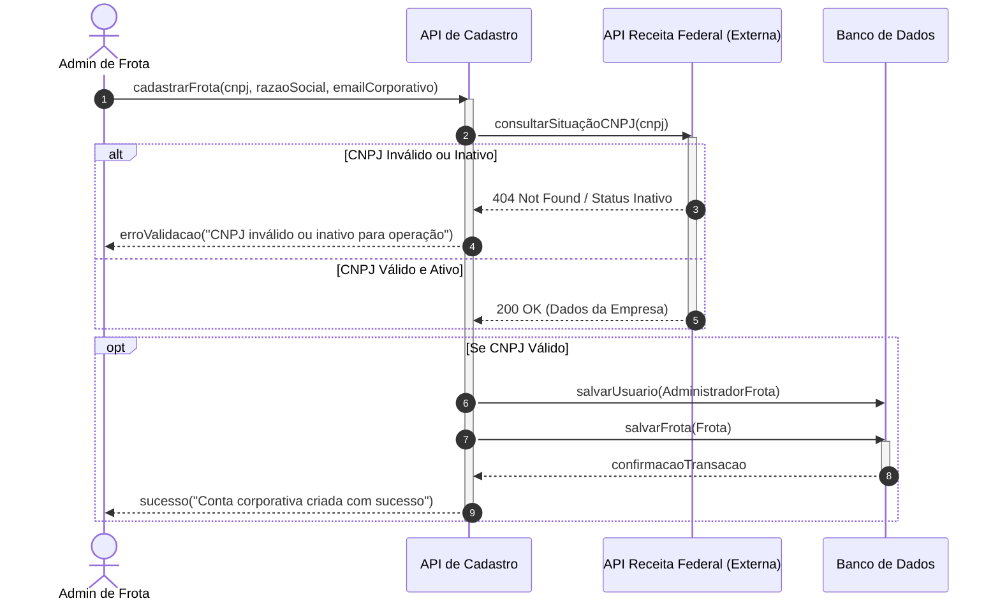

# 3.3 Modelagem Comportamental - Fatia 3

**Fatia:** Um administrador de frota se cadastra no sistema

**Justificativa da escolha do diagrama:** Retomamos o **Diagrama de Sequência** nesta fatia pois o foco arquitetural do cadastro corporativo está na integração entre componentes de fronteira. A complexidade não reside nos estados da frota, mas sim na orquestração: o sistema precisa validar dados em uma API externa (Receita Federal), instanciar o perfil corporativo e persistir no banco de dados com tratamento de exceções.

## Diagrama de Sequência: Cadastro Corporativo

